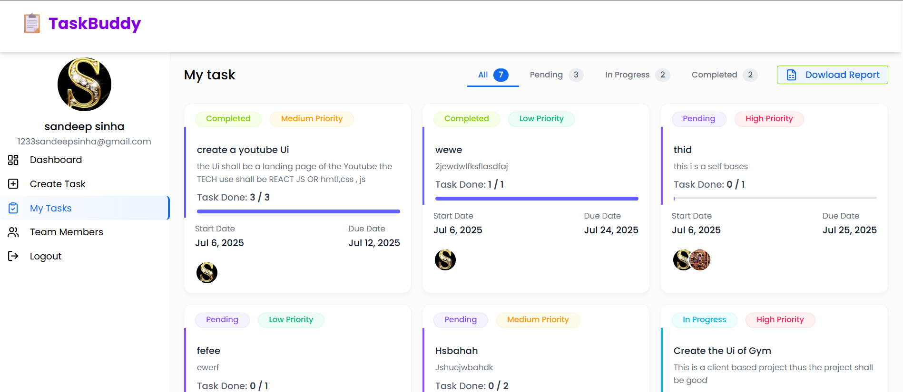

<p align="center">
  
</p>
<h2 align="center">Task Buddy</h2>
<p align="center">
  <a href="https://task-buddy-q3lt.vercel.app/">Demo</a>
</p>


<details>
  <summary >Table of Contents</summary>
  
  1. [Deployed Link & Working Demo](#deployed-link--working-demo)
  2. [About The Project](#about-the-project)
     - [Built With](#built-with)
  3. [Getting Started](#getting-started)
     - [Prerequisites](#prerequisites)
     - [Installation](#installation)
  4. [Usage](#usage)
  5. [Roadmap](#roadmap)
  6. [Contact](#contact)

</details>

### Deployed Link & Working Demo
<p align="center">
  <a href="https://task-buddy-q3lt.vercel.app/">Click me</a>
</p>
<p align="center">
  
  
</p>


###  <u>About The Project </u>

<h7>**Task Buddy**  is a full-stack task management web application built with the ***MERN stack (MongoDB, Express.js, React.js, and Node.js)*** that helps users efficiently organize and track their daily tasks.
It features ***Firebase Google Authentication*** for secure user login, making it easy to manage tasks across devices.</h7>

- <small>With an easy-to-use interface, users can:

- Sign in with ***Google via Firebase Authentication***.

- Add ***new tasks*** with a title and deadline.

- ***Edit and update*** existing tasks.

- ***Delete*** tasks once completed or no longer needed.

- ***Prioritize*** tasks by importance.

- ***Download task*** lists as an ***Excel sheet*** for offline tracking or sharing.

- View and manage tasks on both ***desktop*** and ***mobile devices***. </small>


#### Built With

<table>
  <tr>
    <th colspan="3" align="center"><u>FrontEnd</u></th>
  </tr>
  <tr>
    <td><a href="https://react.dev/"></a></td>
    <td><a href="https://vitejs.dev/"></a></td>
    <td><a href="https://tailwindcss.com/"></a></td>
  </tr>
  <tr>
    <td><a href="https://reactrouter.com/"></a></td>
    <td><a href="https://axios-http.com/"></a></td>
    <td><a href="https://www.chartjs.org/"></a></td>
  </tr>
  <tr>
    <td><a href="https://recharts.org/en-US/"></a></td>
    <td><a href="https://react-icons.github.io/react-icons/"></a></td>
    <td><a href="https://react-hot-toast.com/"></a></td>
  </tr>

  <tr>
    <th colspan="3" align="center"><u>Authentication / Firebase</u></th>
  </tr>
  <tr>
    <td align="center"  colspan="3"><a href="https://firebase.google.com/"></a></td>
    <tr>
    <td colspan="3" align="center" ><a href="https://firebase.google.com/docs/admin"></a></td>
    </tr>
  </tr>

  <tr>
    <th colspan="3" align="center"><u>Backend Libraries</u></th>
  </tr>
  <tr>
    <td><a href="https://github.com/dcodeIO/bcrypt.js/"></a></td>
    <td><a href="https://github.com/expressjs/body-parser"></a></td>
    <td><a href="https://github.com/expressjs/cors"></a></td>
  </tr>
  <tr>
  <td><a href="https://nodejs.org/"></a></td>
    <td><a href="https://github.com/motdotla/dotenv"></a></td>
    <td><a href="https://expressjs.com/"></a></td>
  </tr>
  <tr>
    <td><a href="https://jwt.io/"></a></td>
    <td><a href="https://mongoosejs.com/"></a></td>
     <td><a href="https://www.npmjs.com/package/nodemon"></a></td>
  </tr>
  <tr>
   
  </tr>

  <tr>
    <th colspan="3" align="center"><u>Other Backend Libraries</u></th>
  </tr>
  <tr>
    <td><a href="https://github.com/exceljs/exceljs"></a></td>
    <td><a href="https://github.com/expressjs/multer"></a></td>
    <td><a href="https://nodemailer.com/"></a></td>
  </tr>

  <tr>
    <th colspan="3" align="center"><u>Version Control and Hosting</u></th>
  </tr>
  <tr>
    <td><a href="https://git-scm.com/"></a></td>
    <td><a href="https://vercel.com/"></a></td>
    <td><a href="https://render.com/"></a></td>
  </tr>
</table>


### Getting Started
To get a local copy up and running, follow these simple steps.

#### **Prerequisites**
Make sure you have the following installed:
- Node.js (v18 or above recommended)
- npm (comes with Node.js) or yarn

#### **Installation**
1. Clone the repo
```bash
  git clone https://github.com/sinhasandeep2006/task-buddy.git
```
2. Move to project folder
```bash
   cd task-buddy
```

3. Install backend dependencies
```bash
  cd backend
  npm install
```
4. Install frontend dependencies
```bash
  cd ../frontend
  npm install
```
5. Running the Project
    <small>Start backend server (in /backend folder) </small>
```bash
  npm run dev
```
6. Running the Project
    <small>Start frontend dev server (in /frontend folder, new terminal)
bash
Copy code
 </small>
```bash
  npm run dev
```


## 📋 Usage

Here’s how you can use **Task Buddy** after setting it up:
<h4> 🗂️ Sidebar Menu Structure</h4>

<small>✅ Admin Sidebar Menu:  
| Icon | Label         | Route Path            |
|------|---------------|-----------------------|
| 📊   | Dashboard      | `/admin/dashboard`    |
| ✅   | Manage Tasks   | `/admin/tasks`        |
| ➕   | Create Task    | `/admin/create-task`  |
| 👥   | Team Members   | `/admin/users`        |
| 🚪   | Logout         | `logout`              |

---

 ✅ User Sidebar Menu: 
| Icon | Label         | Route Path            |
|------|---------------|-----------------------|
| 📊   | Dashboard      | `/user/dashboard`     |
| ➕   | Create Task    | `/admin/create-task`  |
| ✅   | My Tasks       | `/user/tasks`         |
| 👥   | Team Members   | `/admin/users`        |
| 🚪   | Logout         | `logout`              |

> ℹ️ **Note:** "Create Task" & "Team Members" link to admin routes, so if needed, you can restrict via backend or frontend guards.

---

### 🎯 Dropdown Options (Task Settings)
***<u>Priority Levels:</u>***
- Low
- Medium
- High

***<u>Task Status Options:</u>***
- Pending
- In Progress
- Completed
</small>
---
 ***1. User Authentication (Google Login)***
- Click **Sign in with Google** to log in securely.
- Authentication is handled using **Firebase**.
<p align="center">
  <u><h4> Login </h4></u>
  
  <u><h4> Sign Up </h4></u>
  

</p>
---

### ✅ **2. Task Management**
- **Add New Task:** Enter the task title, description, priority, and due date.
- **Edit Task:** Update task details easily from the dashboard.
- **Delete Task:** Remove tasks you no longer need.
- **Status Tracking:** Change task status (e.g., Pending, In Progress, Completed).


---

### ✅ **3. Data Visualization**
- View task statistics with interactive charts:
  - **Bar Charts**
  - **Doughnut Charts**
  
- Visualize task completion, status distribution, and other metrics.

---

### ✅ **4. Export to Excel**
- Easily download all tasks in **Excel (.xlsx)** format with a single click.



---

### ✅ **5. File Uploads**
- Upload attachments or related files for tasks (powered by **Multer**).


---

### ✅ **7. History Tracking**
- Keep a record of all task actions (add, update, delete) within the app.


---

### 🔥 **Live Demo:**  
[https://task-buddy-q3lt.vercel.app/](https://task-buddy-q3lt.vercel.app/)

## Roadmap
Here’s the development plan and upcoming features for the Task Buddy:

 ## ✅ Features Checklist

### **Authentication & User Management**
- [x] Register User
- [x] Login User
- [x] Google Login (Firebase Auth)
- [x] Get User Profile
- [x] Update User Profile
- [x] Upload User Profile Image
- [x] Delete User (Admin only)
- [x] Get All Users (Admin only)
- [x] Get User by ID

---

### **Task Management**
- [x] Create Task 
- [x] Update Task
- [x] Delete Task (Admin only)
- [x] Update Task Status
- [x] Update Task Checklist (To-Do Items)
- [x] Get Task by ID
- [x] Get All Tasks (Admins see all, Users see assigned)
- [x] Dashboard Data (Admin & User Specific)

---

### **Reports & Export**
- [x] Export Task Report (Excel)
- [x] Export User Report (Excel)

---

### **Other Features**
- [x] File Upload (Multer)
- [x] Secure API Access (JWT Auth & Middleware Protection)
- [x] Admin Role Middleware Access Control
- [X] Admin Analytics Dashboard (More Insights)
- [X] Enhance Dashboard Charts & Analytics
---

### 🛠️ **In Progress**
- [ ] Add Task Reminders & Due Date Alerts  
  
- [ ] Multi-Language Support (i18n)

---

### 🚀 **Future Plans**
- [ ] Advanced Search & Filters for Tasks


## Contact
**Sandeep sinha**- **@avtadell** - **sandeep.sinha.dev@gmail.com**
